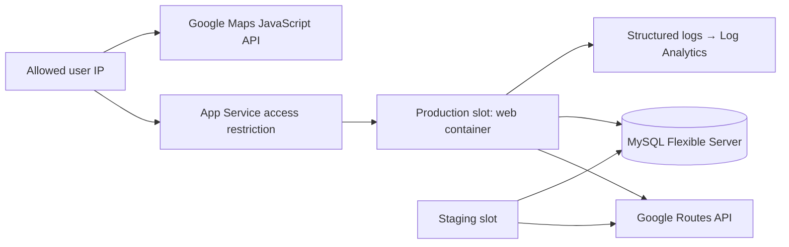
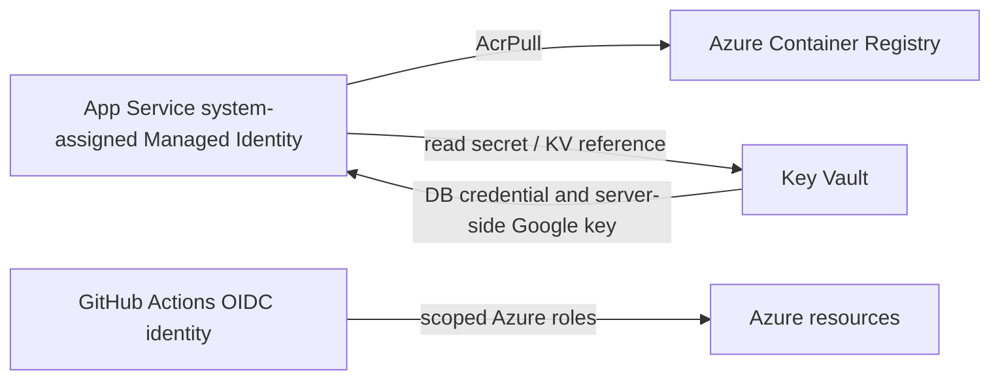

# Masterplan — Hanoi Trip Planner trên Azure

> **Trạng thái:** kế hoạch thực thi duy nhất cho project.  
> **Mục tiêu:** hoàn thành bài thực tập Azure bằng một web app Trip Planner cho Hà Nội; các tiêu chí chấm chính thức luôn đối chiếu với đề gốc.  
> **Nguồn đã hợp nhất:** đề gốc, kế hoạch tăng tốc 15 ngày, lịch D16–D25, các quyết định product và yêu cầu source scan trong `README (1).md` + `gitlab-ci.yml`. README GitLab mặc định được lưu tại `docs/reference/gitlab-template-README.md`; các gợi ý Kubernetes/AWS trong đó không đổi phạm vi Azure của đề. Các file cũ trong `AzureLearn/` được giữ nguyên để đối chiếu đề bài, không dùng làm kế hoạch triển khai song song.

## 1. Quyết định đã chốt

Đối chiếu mới nhất: [Requirements audit](docs/REQUIREMENTS_AUDIT.md). Hướng dẫn bổ sung build Dockerfile khi mở MR được áp dụng cho GitHub PR trong required job `container-check`: build riêng, smoke với `--no-build`, không push image. Snapshot template/TI blacklist nay đã được cung cấp tại workspace; các ghi chú bên dưới về thiếu nguồn là trạng thái lịch sử, còn việc đối chiếu/tích hợp policy chưa hoàn tất.

### Cập nhật phạm vi ngày 25/09/2026

Hoàn thiện phần bắt buộc ở mức first-pass chỉnh chu, áp dụng những nội dung đã học và phát hành bằng GitHub feature branch → PR → CI → squash merge `main`. CI/CD và Terraform được phép đưa vào repo; Azure deploy thật chỉ bật khi có OIDC/resource và phải có evidence thật.

Đã có source React/Node, MySQL local, Dockerfile distroless, test, active GitHub workflows, Terraform bootstrap/app và bộ deliverable. Google live/Azure vẫn chưa test vì chưa có credentials/resources; chế độ demo và mọi trạng thái pending phải ghi rõ. Xem README, `docs/LOCAL_VALIDATION.md`, `known-issues.md` và `evidence/`.

| Hạng mục            | Quyết định                                                                                                                                                                                              |
| ------------------- | ------------------------------------------------------------------------------------------------------------------------------------------------------------------------------------------------------- |
| Product             | **Hanoi Trip Planner**: lập hành trình A → B bằng giao thông công cộng, giao diện gọn lấy cảm hứng từ Opal Travel; không sao chép thương hiệu hoặc UI nguyên bản.                                       |
| Route engine        | **Google Routes API** là nguồn tính route chính. Không dùng LLM trong luồng tìm đường.                                                                                                                  |
| Bản đồ              | Google Maps JavaScript API để hiển thị marker và route Google. Bản demo local dùng MapLibre + OpenFreeMap, bản đồ thật khu vực Hà Nội; chỉ vẽ tuyến demo nét đứt, không vẽ route Google lên bản đồ này. |
| Dữ liệu transit phụ | BusMaps chỉ là nguồn bổ sung sau khi kiểm tra API, giới hạn và license. Không reverse-engineer/scrape API nội bộ của VinBus, ứng dụng vé, Grab hay XanhSM.                                              |
| Cá nhân hoá         | Không làm thuật toán ưu tiên route ở v1. Google trả các phương án; UI trình bày rõ thời gian, số lần chuyển tuyến, đi bộ và từng chặng.                                                                 |
| Dữ liệu app         | MySQL lưu hành trình yêu thích; bảng phục vụ đề vẫn tên/endpoint là `items`.                                                                                                                            |
| Hạ tầng             | Docker → ACR → Linux App Service + staging slot; MySQL Flexible Server; Key Vault; Log Analytics/Azure Monitor; toàn bộ khai báo bằng Terraform.                                                        |
| Quy trình           | Trunk-based: PR → CI; chỉ `main` deploy qua CD → staging slot → smoke test → swap.                                                                                                                      |
| Source security CI  | GitHub Actions thay GitLab: bốn scan chạy song song trên PR, gate `source-security-gate`; secret và HIGH/CRITICAL chặn, MEDIUM/LOW cảnh báo. Policy SCA tạm thời HIGH/CRITICAL, chờ TI blacklist gốc.   |
| Phạm vi an toàn     | Sandbox, dữ liệu giả; không commit secret, không đưa dữ liệu công ty vào repo/AI, không tìm cách vượt kiểm soát SOC.                                                                                    |

## 2. Product scope

### Vấn đề cần giải quyết

Google Maps đã có tìm đường. App này trình bày hành trình Hà Nội dễ thực hiện hơn: thông tin gọn theo từng chặng, điểm chuyển tuyến và các hành trình đã lưu.

### Người dùng và user flow v1

Người dùng mở app trong IP whitelist, nhập điểm đi và điểm đến, chọn thời điểm đi, xem các phương án Google trả về, mở chi tiết một phương án và có thể lưu A → B để mở lại sau.

```text
Mở app
  → nhập điểm đi / điểm đến
  → chọn thời điểm “đi ngay” hoặc thời điểm trong ngày
  → nhận danh sách phương án + map
  → xem từng chặng: đi bộ / bus / metro / chuyển tuyến
  → lưu hành trình yêu thích
```

### In scope cho v1

- Ô tìm điểm đi/đến, nút đảo chiều, chọn thời điểm.
- Google Map và route polyline.
- Danh sách route card: tổng thời gian, giờ đến, số chặng/chuyển tuyến, quãng đường đi bộ, mode và tuyến nếu API trả về.
- Drawer/chi tiết hành trình theo từng leg.
- Lưu/liệt kê hành trình yêu thích qua `POST|GET /items`.
- Các endpoint kiểm chứng hạ tầng của đề, test và JSON logs.

### Không làm trong v1

- Đăng nhập người dùng hoặc kết nối tài khoản ứng dụng giao thông khác.
- Thu thập vị trí nền, dữ liệu khách hàng thật, booking taxi/Grab/XanhSM.
- Tự viết thuật toán transit routing, realtime guarantee, dự báo trễ hay LLM assistant.
- Đồng bộ trực tiếp với API không công khai của VinBus, hệ thống vé Hà Nội hay app khác.
- Native mobile app; đây là responsive web app.

### Backlog sau khi M1–M11 đã hoàn tất

1. Adapter BusMaps được cấp quyền: enrich trạm/tuyến/ETA, hiển thị nguồn và thời điểm dữ liệu.
2. Cache route hợp lệ theo điều khoản API để giảm độ trễ.
3. Tài khoản người dùng và hành trình cá nhân, chỉ sau khi có threat model và auth scope rõ ràng.
4. Tích hợp realtime chính thức khi có developer API công khai hoặc quyền truy cập phù hợp.

## 3. UX direction

Lấy cảm hứng từ Opal ở tính phân cấp thông tin, không sao chép giao diện.

```text
Desktop
┌──────────────────────── left panel ─────────────────────┬──── map ────┐
│ Logo / “Hanoi Trip Planner”                              │ markers     │
│ [ Điểm đi                         ]                      │ route line  │
│ [ Điểm đến                        ] [đảo chiều]          │             │
│ [ Đi ngay / thời điểm ] [Tìm đường]                      │             │
│                                                          │             │
│ Route card 1: 42 phút · 1 chuyển tuyến · 8 phút đi bộ     │             │
│   Đi bộ → Bus ... → Metro ...                            │             │
│ Route card 2: ...                                        │             │
└─────────────────────────────────────────────────────────┴─────────────┘
```

- Một hành động chính: **Tìm đường**. Không nhồi filter/setting vào màn đầu.
- Route card ưu tiên khả năng đọc lướt: thời lượng lớn, các mode/tuyến theo thứ tự, đi bộ và chuyển tuyến ở hàng phụ.
- Màu chỉ đại diện mode/route; không dùng màu làm tín hiệu duy nhất. Có icon và text đi kèm.
- Chi tiết route mở trong panel/drawer, không điều hướng sang trang mới.
- Mobile dùng bottom sheet cho input và route cards; map vẫn là background.
- Có trạng thái loading, no-results, API error và unavailable transit rõ ràng.

## 4. Thiết kế chức năng và API

### API bắt buộc của đề

| Endpoint              | Hành vi của Hanoi Trip Planner                                           | Mục đích chấm         |
| --------------------- | ------------------------------------------------------------------------ | --------------------- |
| `GET /health`         | Trả health/readiness theo mức đã ghi rõ; dùng warm-up/smoke probe.       | Slot warm-up, probe   |
| `GET /version`        | Trả `buildSha`, image/version và môi trường không nhạy cảm.              | Chứng minh swap A → B |
| `GET /load?seconds=n` | Đốt CPU có giới hạn an toàn, validate `n`; chỉ dùng test autoscale ngắn. | Autoscale             |
| `GET /items`          | Danh sách hành trình yêu thích trong MySQL.                              | Đọc DB                |
| `POST /items`         | Lưu A/B và metadata tối thiểu của hành trình yêu thích.                  | Ghi DB                |
| `GET /boom`           | Ném exception có chủ đích, gắn request ID vào log.                       | Alert/monitoring      |

### API product bổ sung

| Endpoint       | Hành vi                                                                                       |
| -------------- | --------------------------------------------------------------------------------------------- |
| `POST /routes` | Backend validate A/B/thời điểm, gọi Google Routes, chuẩn hoá response thành route cards/legs. |

Backend, không phải browser, gọi Google Routes. Điều này giữ server credential ở Key Vault, cho phép rate limit/log/cache và tránh lộ key server.

### Model dữ liệu v1

`items` là một hành trình yêu thích, không phải toàn bộ response thô của Google:

```text
items
  id
  label                 -- ví dụ “Đi làm” (optional)
  origin_label
  origin_lat, origin_lng
  destination_label
  destination_lat, destination_lng
  departure_time_hint   -- nullable
  created_at, updated_at
```

Lý do không lưu nguyên route response: thời gian và tuyến có thể thay đổi. Khi mở lại favorite, app tìm route mới. Nếu cần lưu snapshot để debug, chỉ lưu metadata tối thiểu đã được review, có TTL và không chứa dữ liệu nhạy cảm.

## 5. Kiến trúc mục tiêu

### Stack tối giản

- Frontend: React + TypeScript, responsive SPA.
- Backend: Node.js + TypeScript, một web server/API; phục vụ frontend build hoặc cùng Docker image để giảm số service.
- Database: Azure Database for MySQL Flexible Server.
- Container: một Docker image, tag bằng Git commit SHA.
- Azure: ACR, App Service Plan, Linux Web App production + staging slot, Key Vault, Log Analytics workspace, Azure Monitor/alerts.
- IaC/pipeline: Terraform và GitHub Actions.

Stack có thể điều chỉnh trước khi bắt đầu code nếu môi trường có ràng buộc, nhưng không đổi kiến trúc một-container hay các must-have của đề mà không cập nhật decision log.

### Traffic flow



### Authentication/secret flow



- ACR admin user luôn disabled; App Service pull bằng Managed Identity + `AcrPull` đúng scope.
- App settings chứa Key Vault reference, không chứa secret plaintext.
- Tách browser Maps key và server Routes key nếu cả hai cần key: browser key bị giới hạn HTTP referrer; server key nằm Key Vault, giới hạn API/quota theo khả năng của provider.
- MySQL chỉ allow App Service outbound IP cần thiết, TLS bật; không dùng rule “allow all Azure services”.

### Deploy/release flow

```mermaid
flowchart LR
    F[Feature branch ≤ 2 ngày] --> PR[Pull request]
    PR --> SCAN[Source scan: Gitleaks · Trivy SCA/SBOM · Trivy misconfig · Semgrep]
    SCAN --> SG[source-security-gate: report + severity policy]
    PR --> CI[App lint/test/build · TF fmt/validate/plan · Docker build + image scan]
    SG --> RG[Required checks / ruleset]
    CI --> RG
    RG -->|pass; MEDIUM/LOW warnings allowed| M[Squash merge to main]
    M --> CD[Build one image tagged SHA]
    CD --> ACR[Push ACR]
    ACR --> STG[Deploy staging slot]
    STG --> SMOKE[Warm-up + /health + /version]
    SMOKE -->|pass| POLL[Start polling production /version each second]
    POLL --> SWAP[Swap staging → production]
    SWAP --> VERIFY[Continue polling until SHA B; save raw log]
    VERIFY --> MON[Monitor / rollback by reverse swap]
```



### CI bổ sung — chuyển yêu cầu GitLab sang GitHub

Chi tiết triển khai, mapping và giới hạn ở [docs/CI_GITHUB.md](docs/CI_GITHUB.md). Hai workflow CI được phân vai:

- `.github/workflows/source-scan.yml`: PR-only, bốn scanner song song rồi `source-security-gate`.
- `.github/workflows/ci.yml`: app lint/test/build, gate tests, Terraform fmt/init/validate và optional OIDC plan artifact, Docker/MySQL smoke + image scan. Source scan không thay thế kiểm tra image/base OS.
- `.github/workflows/cd.yml`: `push` vào `main` → build một release image SHA → scan → push ACR → staging → smoke → observer → swap → verify/rollback; deploy bị khóa cho tới khi Azure/OIDC sẵn sàng. Quy tắc PR-only của source scan không hủy yêu cầu CD này.

| Job                    | Yêu cầu được hợp nhất                                                                                                                                                                               | Artifact                             |
| ---------------------- | --------------------------------------------------------------------------------------------------------------------------------------------------------------------------------------------------- | ------------------------------------ |
| `gitleaks-scan`        | Full history: `fetch-depth: 0`, scan `--all`, redact secret; phát hiện secret chưa được chấp nhận ngoại lệ thì block. `.gitleaksignore` chỉ dùng fingerprint false positive đã giải thích trong PR. | `gitleaks.json`                      |
| `trivy-source-sbom`    | Quét dependency từ lockfile và tạo SBOM CycloneDX. Mọi dependency phải có lockfile khi app được tạo.                                                                                                | `trivy-source.json`, `sbom.cdx.json` |
| `trivy-misconfig`      | Scan Terraform/IaC, Dockerfile và cấu hình được Trivy hỗ trợ.                                                                                                                                       | `trivy-misconfig.json`               |
| `semgrep-sast`         | SAST theo ruleset phù hợp JS/TS/React; lưu JSON và SARIF, metrics tắt. Chưa có ruleset nội bộ để bảo đảm kết quả giống component gốc.                                                               | `semgrep.json`, `semgrep.sarif`      |
| `source-security-gate` | Luôn tổng hợp sau scanner; kiểm tra trạng thái job, tính đầy đủ report và severity. Đếm JSON chuẩn một lần, không cộng lại cùng finding từ SARIF/SBOM.                                              | Job Summary, `summary.md`            |

| Kết quả                                                             | Hành vi GitHub                                    | Merge                                 |
| ------------------------------------------------------------------- | ------------------------------------------------- | ------------------------------------- |
| Secret hoặc HIGH/CRITICAL                                           | Required check fail                               | Chặn                                  |
| Chỉ MEDIUM/LOW                                                      | Check success + warning annotation + bảng Summary | Cho phép                              |
| Không có finding                                                    | Check success                                     | Cho phép nếu các check khác cũng pass |
| Job failed/skipped/cancelled, thiếu/hỏng report, severity chưa biết | Check fail                                        | Chặn; xử lý lỗi scan trước            |

GitHub Actions không dùng trạng thái pipeline màu cam `passed with warnings` giống GitLab; dùng annotation và Summary để thể hiện cảnh báo. Không áp dụng `continue-on-error` cho toàn bộ scanner/gate vì sẽ che lỗi thực thi. Với Semgrep, `ERROR → HIGH`, `WARNING → MEDIUM`, `INFO → LOW` là mapping công khai của bản chuyển, chưa xác nhận tương đương component nội bộ.

**Khác biệt phải theo dõi:** README source scan nói HIGH/CRITICAL chặn chung, nhưng comment trong `gitlab-ci.yml` nói SCA dựa trên TI blacklist. Nội dung component `scan-source@v2.4.0`, blacklist, rules/exceptions nội bộ chưa được cung cấp. Bản GitHub tạm chặn SCA HIGH/CRITICAL; ghi rõ trong Summary và xác nhận lại với người giao trước khi tuyên bố policy tương đương. Không đánh dấu gap này là đã xong.

Giữ việc tắt upload DefectDojo/Dependency-Track. JSON/SARIF/SBOM chỉ lưu GitHub artifact, retention 7 ngày. Không thêm các job chuyên Go/Python/mobile khi app hiện dùng JS/TS. Runner mẫu dùng `ubuntu-24.04`; nếu công ty yêu cầu runner nội bộ thì ánh xạ sang label GitHub đã được cấp, không tự coi tag GitLab là runner GitHub.

Required checks cần cấu hình trong ruleset bảo vệ `main`: bắt buộc PR, không push trực tiếp, yêu cầu `source-security-gate`, thêm app/IaC/image checks khi triển khai. Workflow hiện có `contents: read`, action pin commit SHA, scanner pin image digest, không nhận Azure secret/OIDC. Khi thêm Terraform plan, cấp OIDC riêng cho job và phạm vi tin cậy phù hợp; source scan vẫn không cần quyền Azure.

### Trạng thái và evidence CI hiện tại

Đã chạy local app/container/source scan/gate tests; PR #1 đã qua workflow thật và được squash merge qua ruleset `protect-main`. Terraform đã validate nhưng chưa tạo plan/apply Azure; CD mới chứng minh trigger + safety skip, chưa deploy. Bảng milestone chỉ đánh dấu đạt khi có evidence thật.

## 6. Milestone kỹ thuật

| Must-have           | Implementation decision                                                                                                                                | Evidence phải có                                                                                                                                 |
| ------------------- | ------------------------------------------------------------------------------------------------------------------------------------------------------ | ------------------------------------------------------------------------------------------------------------------------------------------------ |
| M1 Docker + ACR     | Docker image in ACR; admin disabled; App Service MI has `AcrPull`.                                                                                     | Config/role proof + running image.                                                                                                               |
| M2 Zero downtime    | Staging slot warm-up, smoke pass then swap; reverse swap rollback.                                                                                     | Raw `/version` poll: 0 non-200, SHA A → B.                                                                                                       |
| M3 MySQL            | `items` read/write; firewall chỉ App Service outbound IP; TLS.                                                                                         | `/items` CRUD + firewall proof.                                                                                                                  |
| M4 Managed Identity | System-assigned MI for ACR pull and Key Vault access.                                                                                                  | Role/scope matrix and proof.                                                                                                                     |
| M5 Key Vault        | DB credential/server Routes key via KV reference; remove MI permission as negative test.                                                               | App breaks/recovery evidence, no plaintext secret.                                                                                               |
| M6 IP whitelist     | Default deny access restriction; allowed IP gets 200, different origin gets 403.                                                                       | Both real requests.                                                                                                                              |
| M8 Terraform        | Terraform covers all in-scope infra; remote state/lock/bootstrap documented.                                                                           | `destroy` → `apply` raw log, no manual infra step.                                                                                               |
| M9 CI gate          | PR-only CI, no deploy; bốn source scan + SBOM/SARIF/summary; severity gate; tests, Terraform checks/plan artifact, Docker build + image scan, ruleset. | Hai PR đỏ bị chặn thật; thêm PR chỉ MEDIUM/LOW pass có warning; artifact đầy đủ, chứng minh scanner lỗi không bị coi là pass. Ghi gap TI policy. |
| M10 CD              | Only `main`: build once → ACR → staging → smoke → swap.                                                                                                | End-to-end GitHub run + artifact SHA.                                                                                                            |
| M11 Monitoring      | JSON logs, Log Analytics/KQL, dashboard app+infra, 3 alerts/email; at least one triggered.                                                             | Dashboard/query/alert timeline/runbook.                                                                                                          |

## 7. Tiến độ: chương trình cá nhân và lịch của người giao

### Hai đồng hồ tiến độ và mốc D10 gần nhất

- `D` là ngày trong lịch của người giao, có gate và evidence bắt buộc.
- `Day` là đơn vị học trong chương trình cá nhân. Học ba `Day` trong một ngày lịch chỉ tăng tốc phần hiểu; một ngày thực hành chỉ hoàn thành khi có sản phẩm/evidence chạy thật.
- Tại **22/09/2026**, cuộc học đang ở **Day 3**. Theo thông tin “ba ngày nữa là D10”, tạm ánh xạ hôm nay là **D7 của người giao** và D10 rơi vào **25/09/2026**. Nếu lịch của người giao khác, dùng ngày của họ làm chuẩn.
- Tại lần lập lịch 22/09/2026, project chỉ có masterplan. Đến 25/09 đã có app local, CI/CD first-pass, Terraform và deliverable skeleton; GitHub/Azure milestone vẫn phụ thuộc run/evidence thật. Lịch bên dưới là kế hoạch học gốc, không phải ngày hoàn thành thực tế.

| Ngày lịch                  | Nếu học đủ 3 Day/ngày             | Việc phải có để kịp gate thực tế                                                                                                  |
| -------------------------- | --------------------------------- | --------------------------------------------------------------------------------------------------------------------------------- |
| 22/09                      | Day 3–5                           | Chốt app/API; app + Docker local, deploy tay Portal rồi CLI và MySQL `items` chạy. Kiểm kê việc D1–D6 của người giao đã làm thật. |
| 23/09                      | Day 6–8                           | Repo/CI v1, branch policy, Terraform foundation và remote state/locking.                                                          |
| 24/09                      | Day 9–11                          | Terraform các resource, review plan qua PR; kiểm tra MI, Key Vault, MySQL và network bằng evidence thật.                          |
| 25/09 — D10 của người giao | Day 12–14 **về mặt nội dung học** | Ưu tiên gate: `destroy` → `apply` từ môi trường sạch, app chạy, raw log và giải thích được state/lock/dependency.                 |

**Đánh giá:** Nếu bắt đầu đủ 3 Day từ hôm nay (Day 3 là Day đầu của hôm nay), tới 25/09 sẽ học đến **Day 14**. Nếu hôm nay chỉ hoàn thành Day 3 rồi ngày mai mới bắt đầu nhịp 3 Day/ngày, mốc tương ứng là **Day 12**. Cả hai đều chỉ là phép tính tiến độ bài học, không phải bằng chứng vượt D10. Với trạng thái workspace hiện tại, đường găng rất dày; không đánh dấu gate D10 đạt nếu chưa có rebuild và log thật. Nếu thiếu quyền/quota hoặc không kịp, ghi blocker và báo người giao theo quy tắc gate của đề.

### Phase A — hiểu nền và chạy app tay (Day 1–5 của chương trình cá nhân)

Đề gốc quy định **D1–D5 của người giao là AI-OFF cho phần làm**: AI có thể giải thích khái niệm và phản biện kế hoạch; người thực tập tự viết app, Dockerfile và tự thao tác Portal/CLI. Từ **D7 của người giao**, AI được dùng trong phần làm nếu khai báo trong PR. Mọi bước thực tế phải ghi worklog. Quy tắc dùng AI áp dụng theo ngày của người giao, không theo số `Day` vừa học tới.

| Ngày  | Việc product                                                                        | Việc Azure/evidence                               | Exit criterion                                            |
| ----- | ----------------------------------------------------------------------------------- | ------------------------------------------------- | --------------------------------------------------------- |
| Day 1 | Chốt product, scope và data boundaries.                                             | Subscription/RBAC/quota/region; sơ đồ 4 lớp.      | Đủ quyền và biết các giới hạn hạ tầng.                    |
| Day 2 | Hiểu request từ browser đến app/API/DB.                                             | HTTP, DNS/IP/port, inbound/outbound, 200/403/500. | Giải thích được flow và failure layers.                   |
| Day 3 | Xây skeleton UI + API, Google integration được mock nếu chưa có key; `items` local. | Đủ endpoints, test, JSON logs, chạy local.        | `/health`, `/version`, `/items`, `/boom` chứng minh được. |
| Day 4 | Hoàn thiện route cards/map shell với data an toàn.                                  | Docker local; Portal deploy App Service/ACR tay.  | Image local + URL Azure chạy.                             |
| Day 5 | Nối MySQL thật cho favorites.                                                       | Firewall/TLS, deploy lại bằng CLI, teardown.      | `/items` đọc/ghi MySQL cloud.                             |

**Checkpoint Day 5:** app + Docker + MySQL chưa chạy tay thì sửa chỗ này, không chuyển sang Terraform.

### Phase B — tái tạo hạ tầng (Day 6–10 của chương trình cá nhân)

| Ngày   | Việc chính                                                                                                        | Exit criterion                                                                                               |
| ------ | ----------------------------------------------------------------------------------------------------------------- | ------------------------------------------------------------------------------------------------------------ |
| Day 6  | Repo GitHub riêng, ruleset, bật source-scan PR-only (Gitleaks/SCA+SBOM/misconfig/SAST); CI v1 + Terraform checks. | `source-security-gate` là required check; PR đỏ bị chặn; đủ report. File local chưa tính là evidence GitHub. |
| Day 7  | Terraform foundation và dependency graph.                                                                         | Plan được review qua PR.                                                                                     |
| Day 8  | Bootstrap remote state Blob + lock, tách vòng đời state/app.                                                      | Giải thích được state, lock, bootstrap.                                                                      |
| Day 9  | Terraform App Service, ACR, MySQL, Key Vault, MI/RBAC, network, monitoring foundation.                            | Plan artifact + bảng identity/role/scope.                                                                    |
| Day 10 | Rebuild từ môi trường sạch.                                                                                       | `destroy` → `apply`, app chạy, không thao tác tay.                                                           |

**Checkpoint Day 10:** nội dung này trùng yêu cầu gate D10 của người giao, nhưng chỉ được tính đạt khi có rebuild và log thật trước hạn chính thức.

### Phase C — release và vận hành (Day 11–15 của chương trình cá nhân)

| Ngày   | Việc chính                                                                                                                                                                | Exit criterion                                                                                          |
| ------ | ------------------------------------------------------------------------------------------------------------------------------------------------------------------------- | ------------------------------------------------------------------------------------------------------- |
| Day 11 | MI pull ACR, KV references/negative test, MySQL CRUD, IP allowlist, log đầu tiên.                                                                                         | M1, M3–M6 có evidence.                                                                                  |
| Day 12 | CI hoàn chỉnh: unit test route/items, plan artifact, Docker build + image scan; evidence HIGH/CRITICAL chặn, MEDIUM/LOW warning; SCA/SBOM/misconfig/SAST và KQL theo SHA. | M9 có PR đỏ thật + PR warning, đủ artifact và không bỏ qua lỗi scanner; ghi rõ trạng thái TI blacklist. |
| Day 13 | CD main → image SHA → staging → smoke → swap → rollback thử.                                                                                                              | M2/M10 poll log hợp lệ.                                                                                 |
| Day 14 | Dashboard/log view/KQL, 3 alerts + email, autoscale max 2, load test ngắn.                                                                                                | M11 bản đầu và ít nhất một alert thật.                                                                  |
| Day 15 | Freeze feature; rà các tiêu chí đề gốc, README, architecture, runbook, known issues, demo script.                                                                         | Báo cáo/evidence bản đầu sẵn sàng review.                                                               |

### Phase D — kiểm chứng và nộp (theo D16–D25 của người giao)

- D16: gửi repo/evidence bản đầu, ghi rõ gap và xin feedback.
- D17–D18: sửa feedback, bổ sung evidence alert/swap còn thiếu.
- D19–D20: người khác dựng lại theo README, review quyền và secret.
- D21–D22: chuẩn hoá evidence theo đề gốc, raw log, screenshots, KQL và runbook; redaction.
- D23: cross-review lần 2, hoàn thiện `ai-failure-log.md` bằng lỗi AI thật đã gặp.
- D24: incident drill và rehearsal demo 45 phút.
- D25: demo live, nhận feedback, teardown theo kế hoạch.

## 8. Cấu trúc repo app cần tạo

Project app dùng `/home/tts/tts/HanoiTrip/`; `AzureLearn/` chỉ là repo học. Remote GitHub đã được bootstrap `main`; thay đổi hiện tại đi qua feature branch/PR. Cây dưới là cấu trúc hiện tại; evidence cloud vẫn pending.

```text
HanoiTrip/
├── app/                    # frontend + backend TypeScript
├── tests/
├── Dockerfile
├── terraform/
│   ├── bootstrap/           # state storage, vòng đời riêng
│   └── app/                 # toàn bộ infra còn lại
├── .github/workflows/
│   ├── source-scan.yml      # PR source security scans + gate
│   ├── ci.yml               # app/IaC/image checks
│   └── cd.yml               # main → Azure release, disabled until configured
├── .github/pull_request_template.md
├── scripts/ci/              # scan-source.sh + security_gate.py
├── tests/ci/                # test gate policy bằng dữ liệu giả
├── docs/CI_GITHUB.md         # mapping + policy gaps + evidence checklist
├── docs/reference/          # bản README template GitLab gốc
├── evidence/               # theo từng tiêu chí của đề gốc
├── README.md
├── architecture.md
├── runbook.md
├── ai-failure-log.md
├── known-issues.md
└── demo-script.md
```

## 9. Test plan tối thiểu

- Unit: route response normalizer; validation A/B; `items` create/list; `/health` and `/version` contract.
- Integration local: MySQL CRUD; missing DB/config behavior; JSON log shape.
- Manual product: 10 hành trình Hà Nội thật để đánh giá Google transit coverage và UI states, không dùng dữ liệu tài khoản thật.
- Negative: invalid route input; missing Key Vault permission; non-whitelisted IP; fake secret in PR; intentionally vulnerable/bad Docker scenario theo rule đã thống nhất; `/boom`; rollback slot.
- Security CI: secret/HIGH/CRITICAL chặn; MEDIUM/LOW chỉ warning; sạch pass; scanner fail/skip/cancel, report thiếu/hỏng hoặc severity không rõ phải block. Kiểm tra mapping Semgrep và tránh đếm trùng JSON/SARIF/SBOM. Dùng dữ liệu giả cho test policy; dùng PR thử nghiệm có finding an toàn để chứng minh scanner + ruleset thật.
- Trigger: cập nhật PR chạy lại bốn scan; merge/push `main` không chạy source scan. Khi CD được tạo, xác nhận sự kiện đó chỉ kích hoạt CD phù hợp, không bỏ mất release.
- Release: staging `/health` và `/version` pass trước swap; poll production mỗi giây trong swap; không có response non-200.

## 10. Rủi ro và guardrails

| Rủi ro                                              | Cách xử lý                                                                                                    |
| --------------------------------------------------- | ------------------------------------------------------------------------------------------------------------- |
| Google transit không tốt cho một route Hà Nội       | Test 10 hành trình trước khi phụ thuộc UI; hiển thị nguồn/thời điểm; không hứa realtime.                      |
| Chưa có public API từ operator/ticket app           | Không scrape/reverse-engineer; để integration ở backlog.                                                      |
| Secret bị lộ                                        | Key Vault/OIDC/secret scan, rotate nếu lộ, không paste vào chat/repo/evidence.                                |
| SOC chặn công cụ/test                               | Không bypass; ghi blocker, dùng môi trường/kịch bản được phép hoặc xin hướng dẫn chính thức.                  |
| Scope creep UI/data                                 | Không làm feature mới nếu M1–M11 chưa có evidence thật.                                                       |
| Thiếu component/ruleset/TI blacklist nội bộ         | Áp dụng và ghi rõ policy SCA tạm; xác nhận với người giao, không tuyên bố bản GitHub tương đương hoàn toàn.   |
| Source scan xanh nhưng thiếu code hoặc thiếu report | Ghi phạm vi thực tế; report thiếu/scanner lỗi làm gate đỏ. Không coi scan project rỗng là app đã đạt bảo mật. |

## 11. Definition of done

Project chỉ “xong” khi đồng thời đúng ba điều:

1. Người dùng được whitelist có thể tìm route A → B, xem map/route card và lưu favorite vào MySQL.
2. Mỗi milestone kỹ thuật trong tài liệu này có evidence thật, không chỉ ảnh Portal hay pipeline xanh.
3. Một người khác đọc `README.md` có thể tái tạo hệ thống, theo traffic/auth/deploy flow, thực hiện rollback và biết các giới hạn vận hành.

## 12. Việc tiếp theo

1. Hoàn tất PR hiện tại, theo dõi required checks và squash merge; khai báo AI trong PR.
2. Cấu hình Azure OIDC/backend, review Terraform plan rồi mới apply; bổ sung evidence thật M1–M8.
3. Chỉ bật `AZURE_CD_ENABLED` sau khi staging/rollback và cleanup rules được review; lấy evidence M2/M10.
4. Thiết lập Google keys/coverage test khi đến integration; không coi demo là dữ liệu thực tế.
5. Hoàn thiện monitoring/dashboard/alert và xác nhận SCA TI blacklist cùng mâu thuẫn App Insights với người giao.
