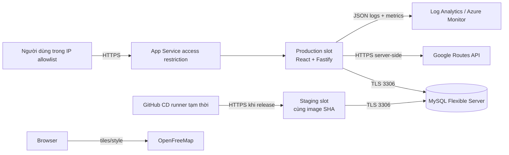
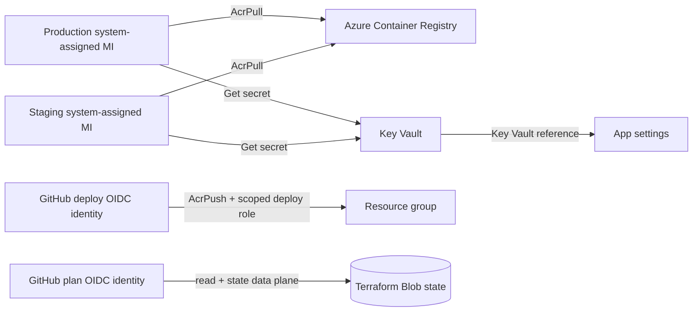
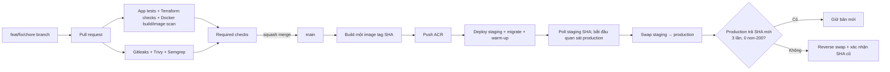

# HanoiTrip architecture

HanoiTrip là một SPA React và API Fastify được đóng gói trong cùng một image. MySQL lưu hành trình yêu thích; route demo chỉ phục vụ phát triển, còn Google Routes là adapter live dự kiến.

## Luồng traffic

MySQL chỉ allow outbound IP của hai slot và IP runner tạm trong lúc migration. Production/staging mặc định từ chối inbound ngoài allowlist. IP runner được xóa trong bước `always()` của CD.

## Luồng identity và secret

ACR admin user bị tắt. GitHub dùng OIDC, không lưu client secret. App settings chỉ giữ Key Vault reference cho password/key server-side; browser key là public-by-design nhưng phải giới hạn referrer và API.

## Luồng release

Migration phải additive/backward-compatible vì hai phiên bản dùng chung production DB trong thời gian swap.

## Ranh giới hiện tại

Kiến trúc local, Terraform và workflow đã có trong repo. Không có Azure credential/resource trong workspace, nên sơ đồ Azure là kiến trúc mục tiêu, chưa phải bằng chứng deploy. Trạng thái thật nằm trong `evidence/M*.md` và `known-issues.md`.
