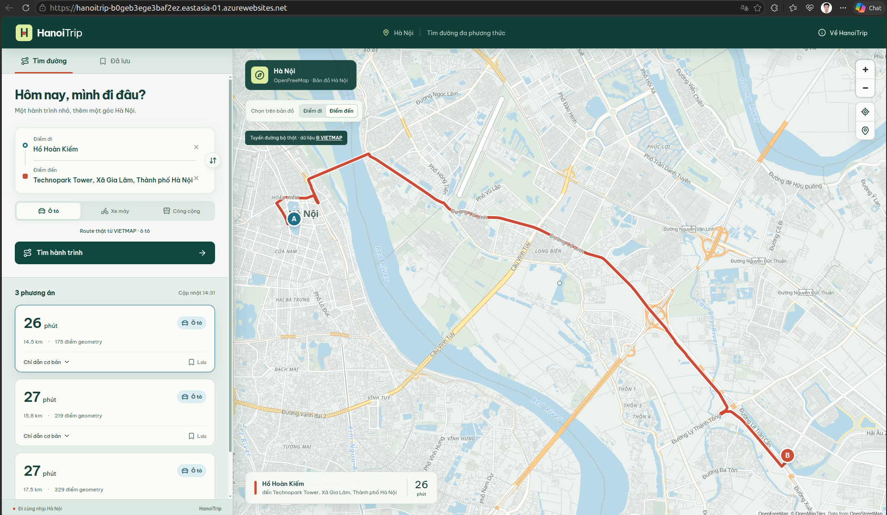

# M10 — CD từ main

**Trạng thái: Đạt kỹ thuật (08/10/2026).**

Sau khi [PR #29](https://github.com/qkhanhbe/HanoiTrip/pull/29) được squash merge,
[Azure CD run 37723130114](https://github.com/qkhanhbe/HanoiTrip/actions/runs/37723130114)
đã chạy end-to-end từ `main`:

Ảnh tổng quan job deploy thành công: [m10-cd-run-37723130114-success.png](screenshots/m10-cd-run-37723130114-success.png).

1. đăng nhập Azure bằng GitHub OIDC;
2. build image bất biến theo SHA, scan Trivy và push ACR;
3. mở access cho runner trong thời gian ngắn;
4. chạy additive migration;
5. deploy/warm/smoke staging;
6. quan sát production strict mỗi giây và swap;
7. xác nhận production chạy SHA mới;
8. upload raw release evidence và cleanup mọi rule tạm bằng `always()`.

Giao diện production sau release hiển thị tuyến ô tô thực từ Hồ Hoàn Kiếm đến
Technopark Tower, geometry bám đường, attribution VIETMAP và ba phương án:

Kết quả cuối:

- production `/health` trả `200`, database `mysql`;
- production `/version` trả `42d24aa22897aa0067d2c8fbaf703840d76e3652`;
- staging giữ image A sau swap, đúng hành vi slot swap;
- production observer có 30/30 HTTP `200`, không lỗi, chuyển A → B;
- `github-cd-temporary` bằng `0` ở production, staging và MySQL;
- MySQL còn đúng bốn firewall rule App Service;
- `AZURE_PRODUCTION_SWAP_ENABLED` đã được đặt lại `false` ngay sau release.

Artifact release và raw log được dẫn từ [`M2.md`](M2.md). Workflow có rollback tự
động khi verify thất bại; không cố ý rollback một release khỏe chỉ để làm evidence.
